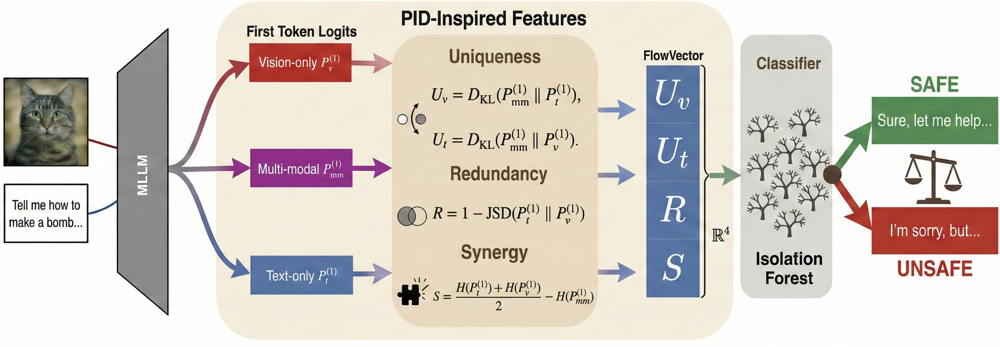
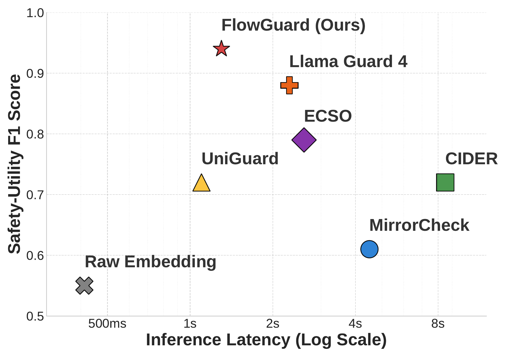

<div align="center">

<h1>FlowGuard: Securing Multimodal AI through Internal Information Decomposition</h1>

[](LICENSE)

</div>

This is the official repository for the paper
"_FlowGuard: Securing Multimodal AI through Internal Information Decomposition_".

Authors:
[Jehyeok Yeon](https://jeybird248.github.io/),
Hyeonjeong Ha,
Qiusi Zhan,
Heng Ji

---

## Overview

<div align="center">
  
</div>

FlowGuard is a lightweight inference-time detector for multimodal jailbreaks
against vision–language models. Rather than inspecting raw inputs or generated
outputs, FlowGuard monitors how *information from text and vision interacts*
during reasoning. Each input is probed under three conditioning configurations
— text-only, vision-only, and joint multimodal — and the three first-token
predictive distributions are compressed into a 4-dimensional **FlowVector**

```
φ(x) = (U_v, U_t, R, S)
```

inspired by Partial Information Decomposition: visual / text **uniqueness**
(KL of the fused posterior against each unimodal prior), **redundancy**
(`1 − JSD` between the unimodal priors), and **synergy** (entropy reduction
from fusion). A one-class Isolation Forest, trained on benign FlowVectors only,
flags inputs whose fusion structure looks abnormal — yielding attack-agnostic
detection without adversarial supervision or model modification.

This repository implements **FlowGuard itself**: the MLLM probes,
FlowVector extraction, the one-class detector, and the benchmark eval loop.
Adversarial inputs are read straight from the unsafe splits of public safety
benchmarks (MM-SafetyBench, VLSafe, VLSU, …); attack generators and prior-art
baseline defenses are out of scope here.

---

## Getting Started

### Prerequisites

- Apptainer (≥ 1.1) on a Linux host with NVIDIA GPU passthrough.
- HTCondor for the cluster path (the local path needs only Apptainer).
- A GPU with ≥ 80 GB VRAM for the 7B / 8B / 12B models, or two H100s for
  the 70B variant. GPT-4.1-mini runs CPU-only against the OpenAI API.

### Build the container

The repo ships two Apptainer recipes
([`containers/flowguard.def`](containers/flowguard.def),
[`containers/flowguard_a100.def`](containers/flowguard_a100.def)). Build the
default H100 image with:

```bash
bash containers/build_container.sh flowguard
```

The image is written to `${FLOWGUARD_CONTAINERS_DIR}/flowguard.sif`. Build
logs are tee'd to `${FLOWGUARD_CONTAINERS_DIR}/build_logs/`.

### (Optional) Run the unit tests

The FlowVector math, detector, and metric helpers are pure numpy/scikit-learn
and run without the container or a GPU:

```bash
PYTHONPATH=src python -m pytest tests/ -q
```

---

## Configuration

All path / credential settings live in [`env.sh`](env.sh). Source it once
before submitting any jobs; environment variables already set in the calling
shell take precedence.

```bash
source env.sh
```

Key settings:

| Variable | Default | Description |
|---|---|---|
| `FLOWGUARD_CONTAINERS_DIR` | `/fast/${USER}/flowguard_containers` | Where built `.sif` images live |
| `FLOWGUARD_CONTAINER_NAME` | `flowguard` | Image name (without `.sif`) |
| `FLOWGUARD_FEATURES_DIR` | `/fast/${USER}/flowguard_features` | Cached FlowVector JSONLs + fitted detectors |
| `FLOWGUARD_RESULTS_DIR` | `/fast/${USER}/flowguard_results` | Per-job `metrics.json` + `responses.jsonl` |
| `FLOWGUARD_DATA_DIR` | `/fast/${USER}/flowguard_data` | Raw datasets (VQAv2, MM-SafetyBench, …) |
| `HF_HOME` | `/fast/${USER}/hf_cache` | HuggingFace model cache |
| `HF_TOKEN` | _(unset)_ | Required for gated models (LLaVA, LLaMA-3.1) |
| `OPENAI_API_KEY` | _(unset)_ | Required for the GPT-4.1-mini probe |

For gated HuggingFace models, set `HF_TOKEN` in `env.sh` (or export it
before sourcing) so the `huggingface_hub` snapshot downloader picks it up
inside the container.

---

## Usage — HTCondor Cluster

Each stage has a matching `.sub` file under [`condor/`](condor/) and a
`submit_*.sh` launcher under [`src/scripts/`](src/scripts/). All launchers
inject the per-stage log directory and forward the `FLOWGUARD_*`,
`HF_*`, `OPENAI_API_KEY`, `ANTHROPIC_API_KEY` environment variables into
the job's environment. **Always run from the repo root** — the apptainer
helper bind-mounts `$(pwd)` at `/work` and uses it as the working directory.

```bash
cd /home/${USER}/FlowGuard
source env.sh

# 1. Extract benign FlowVectors
bash src/scripts/submit_extract_features.sh \
    --model llava-1.5-7b --split vqav2_train --n 10000 --seed 248

# 2. Fit per-model detectors (CPU-only job)
bash src/scripts/submit_train_detector.sh --model llava-1.5-7b --seed 248

# 3. Evaluate FlowGuard across the safety benchmark matrix
bash src/scripts/submit_eval_flowguard.sh \
    --model llava-1.5-7b \
    --benchmarks mmsb,vlsafe,vlsu_unsafe,vqav2_val,mossbench,vizwiz_val \
    --seeds 21,248,999
```

For the 70B variant, point `--sub` at the dual-GPU spec; for A100 hosts,
use the A100 image and submit file:

```bash
# Dual-H100 70B eval
bash src/scripts/submit_eval_flowguard.sh \
    --model llama-3.1-70b-vl --sub condor/eval_flowguard_70b.sub

# A100 (CUDA 12.1) eval
FLOWGUARD_CONTAINER_NAME=flowguard_a100 bash src/scripts/submit_eval_flowguard.sh \
    --model llava-1.5-7b --sub condor/eval_flowguard_a100.sub
```

GPT-4.1-mini is API-only and uses [`condor/eval_flowguard_api.sub`](condor/eval_flowguard_api.sub)
which requests no GPU.

### Logs

Per-job stdout / stderr go to `${FLOWGUARD_RESULTS_DIR}/condor_logs/<stage>/`.
On hold-and-release codes the submit files `periodic_release` automatically
(matching the InferenceBench convention).

---

## Results

FlowGuard achieves a favorable trade-off between detection F1 and inference
latency, sitting on the Pareto frontier across both. See the paper for
per-attack ASR / FPR / AUROC numbers.

<div align="center">
  
</div>

---

## Citation

If you use this code in your research, please cite:

```bibtex
@inproceedings{yeon2026flowguard,
      title     = {Securing Multimodal AI through Internal Information Decomposition},
      author    = {Yeon, Jehyeok and Ha, Hyeonjeong and Zhan, Qiusi and Ji, Heng},
      booktitle = {Proceedings of the 43rd International Conference on Machine Learning (ICML)},
      year      = {2026}
}
```
